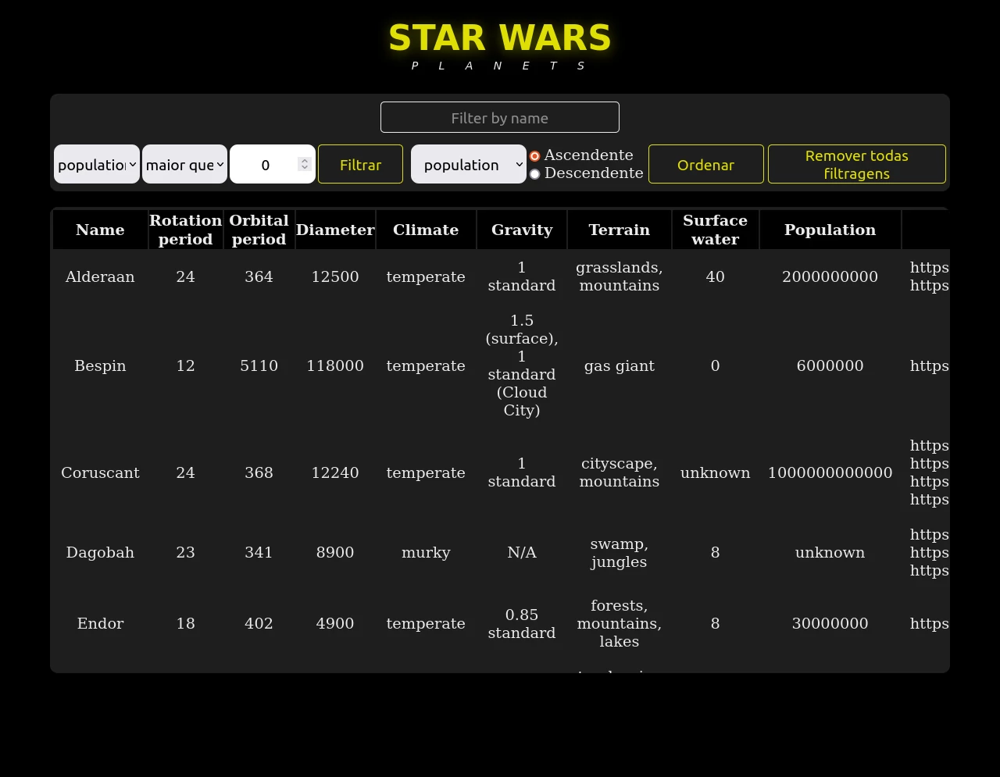
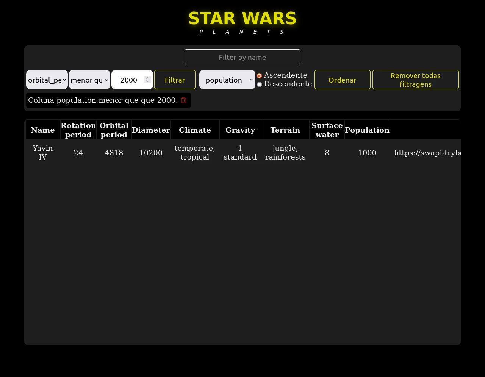
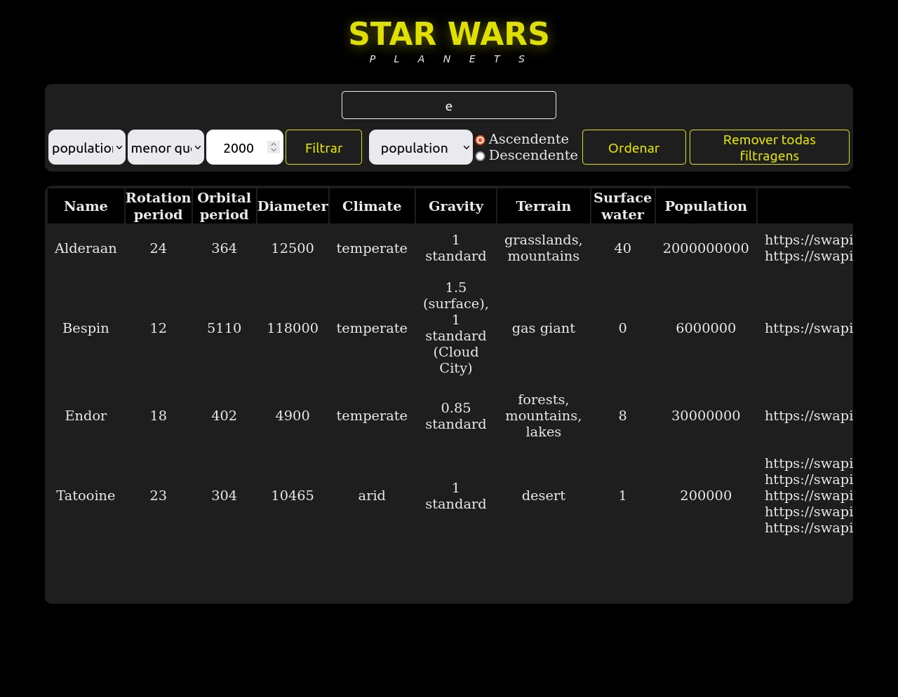

# Sobre

## Seção: `Context API e React Hooks`

- Quando o react foi lançado, componentes funcionais eram limitados. Não sendo possível o uso de estados e nem mesmo ciclo de vida. A única forma era usando componentes de classe, com a versão 16.8 foi lançado hooks, tornando isso possível, de forma mais simples.
- Outra forma de evitar o prop drilling para compartilha o estado de forma nativa no react é com Context API, fazendo com que o componente que precisa da informação acesso ela de forma direta.
#

  

>*clique na imagem para acesso online do projeto*
#
## Projeto: `Starwars Planets Search`

- Tabela de filtro de planetas do universo Starwars, onde é possível criar diversos filtros, por nome, quantidade de campo de forma descendente e crescente.

# Tecnologias e ferramentas usadas 🛠

# Desafios

- O uso de useEffect foi bem simples, os desafios foram entender algumas exigências dos requisitos e do linter fornecido, muitas vezes era necessário montar uma estrutura monitorando alguma função, que não fazia sentido, mas era um bom hábito exigido.

# Conclusão

- Pela primeira experiência com componentes funcionas, tive uma impressão que context API é muito mais simples e fácil que o Redux, mas em projetos futuros usei o Redux com react funcional, e é ele que fez toda diferença com sua simplicidade, também tem o fator que aprendi a usar react com classes, sem ter nenhuma noção com POO, ter essa noção ajudaria muito no aprendizado.

  

    <strong>
      :newspaper_roll: Requisitos solicitados durante o desenvolvimento do projeto
    </strong>
  

 
### Requisitos
*Nome* | *Avaliação*
--- | :---:
1 - Faça uma requisição para o endpoint `/planets` da API de Star Wars e preencha uma tabela com os dados retornados, com exceção dos da coluna `residents` | :heavy_check_mark:
2 - Filtre a tabela através de um texto, inserido num *campo de texto*, exibindo somente os planetas cujos nomes incluam o texto digitado | :heavy_check_mark:
3 - Crie um filtro para valores numéricos | :heavy_check_mark:
4 - Implemente múltiplos filtros numéricos | :heavy_check_mark:
5 - Não utilize filtros repetidos | :heavy_check_mark:
6 - Apague um filtro de valor numérico ao clicar no ícone de X de um dos filtros e apague todas filtragens numéricas simultaneamente ao clicar em outro botão de Remover todas filtragens | :heavy_check_mark:
7 - Ordene as colunas de forma ascendente ou descendente | :heavy_check_mark:

  

    <strong>
      :memo: Todo list
    </strong>
  

  - [x] - ~~Criar aplicação com base nos requisitos da trybe.~~ 
  - [x] - Revisar Estilo dos elementos. 
  - [ ] - Desenvolver testes automatizados.
  - [ ] - Adaptar elementos da aplicação para mobile.

#

  

